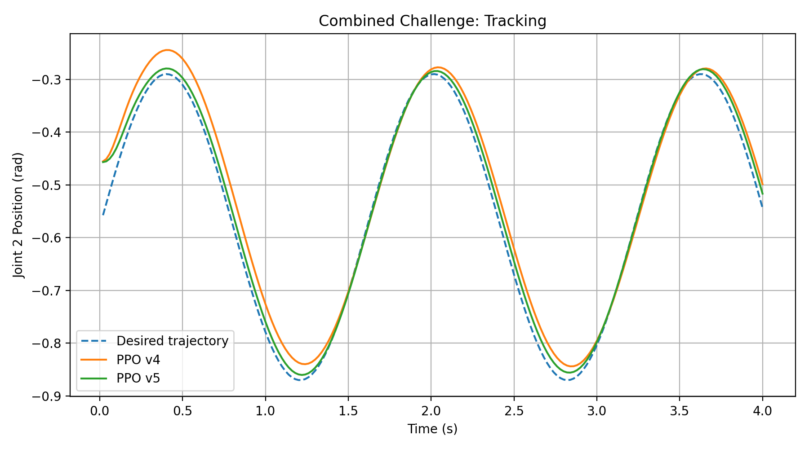

# Franka Panda Simulation, Control and Reinforcement Learning

An end-to-end simulation project for the Franka Panda robot, covering motion planning, collision-aware pick-and-place, dynamics control, constrained MPC, reinforcement learning, and ROS 2 integration across Gazebo and MuJoCo.

> 中文简介：这是我的实习项目成果整理版。项目从 ROS 2 / MoveIt 2 基础运动规划逐步扩展到 Gazebo 自动抓放、MuJoCo–ROS 2 联合仿真、经典动力学控制、约束 MPC 与 PPO 鲁棒控制。


## Highlights

- Built a ROS 2 Humble + MoveIt 2 + Gazebo 11 stack for Panda arm and gripper control.
- Implemented a 15-state, one-command pick-and-place pipeline with an 11-check preflight gate.
- Synchronized the physical Gazebo object state with the MoveIt Planning Scene through attach, transport, detach, release, and final placement.
- Built a MuJoCo 3.11 ↔ ROS 2 bridge for joint commands, joint states, TF, and RViz visualization.
- Benchmarked equivalent joint trajectories in Gazebo and MuJoCo using arrival time, settling time, tracking RMS, and peak speed.
- Implemented and compared PD, gravity compensation, inverse dynamics, computed torque, constrained MPC, and PPO controllers.
- Added torque and torque-rate constraints plus domain randomization and out-of-distribution evaluation for PPO.

## Demonstrations

| ROS 2 / Gazebo automated pick-and-place | MuJoCo / ROS 2 / RViz bridge |
|---|---|
|  |  |

Full-resolution demo recordings are published with the [v1.0.0 release](https://github.com/5Elaine/franka-panda-sim-control-rl/releases/tag/v1.0.0) so the Git repository stays lightweight.

## Quantitative results

| Experiment | Result |
|---|---:|
| Static hold: PD only → PD + gravity | `0.128702 → 0.000001 rad` final error |
| Dynamic tracking: PD + gravity → inverse dynamics → computed torque | `0.031282 → 0.012329 → 0.008018 rad` RMS |
| Nominal error-state MPC | `0.007924 rad` RMS, `6.127 ms` average solve time, `0` deadline misses |
| Constraint challenge: clipped computed torque → constrained MPC | `0.135545 → 0.111671 rad` RMS |
| Safe-action PPO v3 → v4 | `0.021994 → 0.013099 rad` RMS |
| PPO v4 → domain-randomized PPO v5 | `0.017704 → 0.011220 rad` average RMS |
| PPO v5 out-of-distribution evaluation | `0.017948 rad` average, `0.035629 rad` worst RMS, `0%` termination |



These Week 4 control and RL results use **Panda joint 2**, not simultaneous full-arm learned control. See [results and methodology](docs/results.md) for the exact scope and interpretation.

## Repository layout

```text
.
├── ros2_ws/src/              # Three ROS 2 packages for motion, Gazebo, and pick-place
├── mujoco/
│   ├── code/                 # Basics, Panda control, ROS 2 bridge, benchmarks
│   ├── control/              # Classical control, MPC, and PPO
│   └── config/               # RViz configuration
├── results/                  # Raw CSV data, summaries, and plots
├── assets/images/            # Portfolio-ready screenshots and figures
└── docs/                     # Architecture, setup, results, and project scope
```

## Quick start

The two simulation tracks have separate environments:

- **ROS 2 track:** Ubuntu 22.04, ROS 2 Humble, Gazebo 11, MoveIt 2, `ros2_control`, and the Franka ROS 2 description/configuration packages.
- **MuJoCo track:** Python 3, MuJoCo 3.11.0, and the packages in `requirements-mujoco.txt`.

Detailed instructions are in [docs/setup.md](docs/setup.md). The MuJoCo Menagerie model is intentionally not copied into this repository; set `MUJOCO_MENAGERIE_PATH` to a local checkout.

## Documentation

- [Architecture](docs/architecture.md)
- [Setup and reproduction](docs/setup.md)
- [Results and methodology](docs/results.md)
- [Scope, limitations, and reproducibility notes](docs/project-scope.md)

## Project status

This repository is a curated internship-project snapshot. It contains the source code, trained PPO v4/v5 checkpoints, experiment CSVs, and presentation figures. It does **not** claim real-robot deployment, vision-based grasping, sim-to-real validation, or full-arm MPC/RL control.

## Third-party components

Robot descriptions and simulation models remain external dependencies. See [THIRD_PARTY_NOTICES.md](THIRD_PARTY_NOTICES.md). No project-wide reuse license is granted by this repository unless one is added explicitly.
