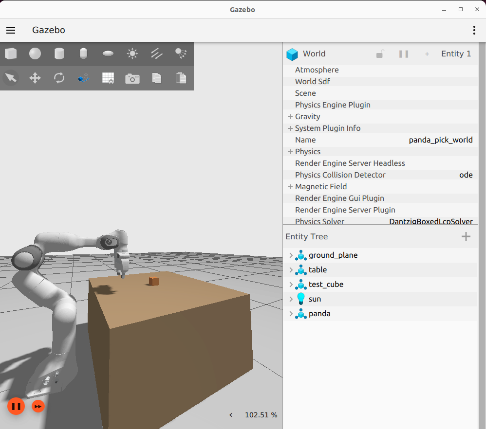
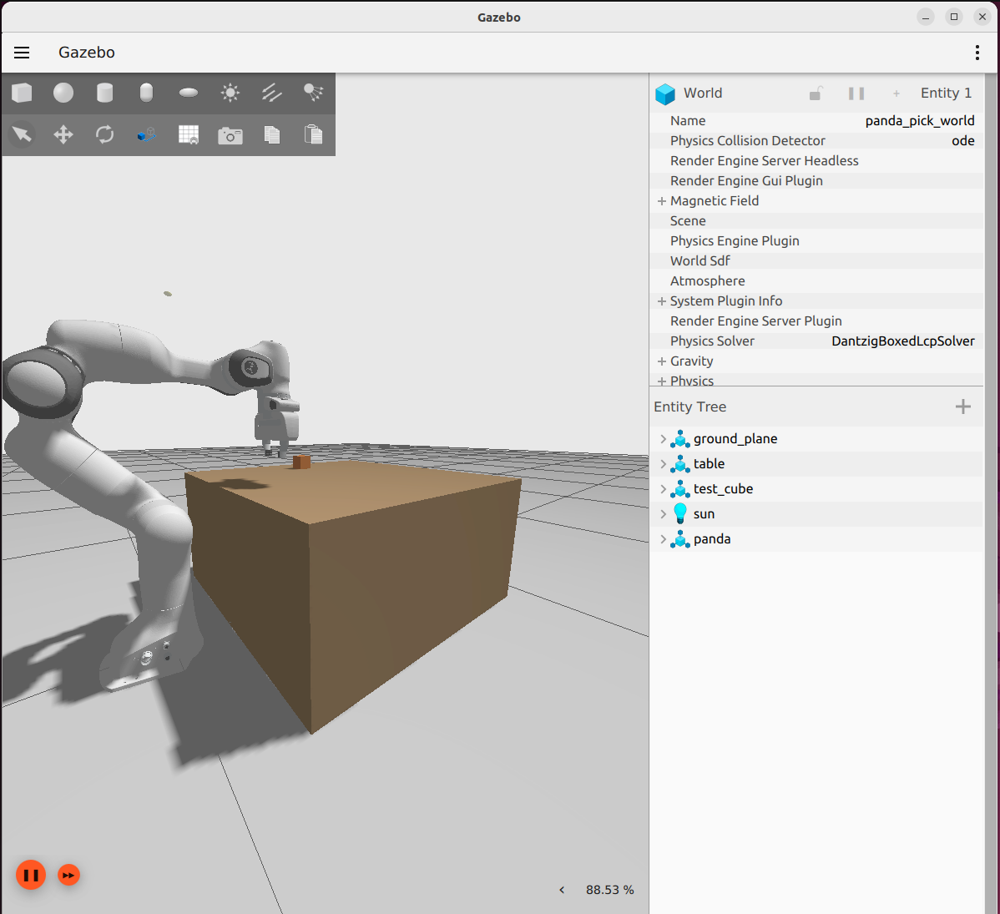
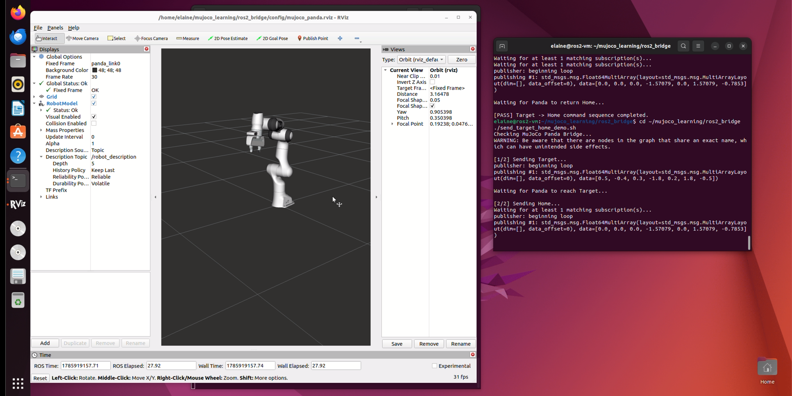

# Franka Panda 机器人仿真、控制与强化学习

[English](README.md) | [简体中文](README.zh-CN.md)

一个面向 Franka Panda 机器人的端到端仿真项目，涵盖运动规划、碰撞感知抓放、动力学控制、约束模型预测控制、强化学习，以及基于 Gazebo、MuJoCo 和 ROS 2 的联合仿真。



## 项目亮点

- 搭建 ROS 2 Humble、MoveIt 2 与 Gazebo 11 组成的 Panda 机械臂及夹爪控制系统。
- 实现包含 15 个状态的一键自动抓放流程，并在执行前完成 11 项系统检查。
- 在抓取、搬运、分离、释放和最终放置过程中，同步 Gazebo 物理对象与 MoveIt Planning Scene。
- 实现 MuJoCo 3.11 与 ROS 2 的双向桥接，支持关节指令、关节状态、TF 和 RViz 可视化。
- 使用到达时间、稳定时间、跟踪 RMS 误差和峰值关节速度，对 Gazebo 与 MuJoCo 中的等效轨迹进行比较。
- 实现并比较 PD、重力补偿、逆动力学、计算力矩、约束 MPC 和 PPO 控制器。
- 在 PPO 中加入力矩及力矩变化率约束、域随机化和分布外测试。

## 仿真演示

| ROS 2 / Gazebo 自动抓放 | MuJoCo / ROS 2 / RViz 桥接 |
|---|---|
|  |  |

完整分辨率的演示录屏发布在 [v1.0.0 Release](https://github.com/5Elaine/franka-panda-sim-control-rl/releases/tag/v1.0.0) 中，以保持 Git 仓库轻量。

## 量化结果

| 实验 | 结果 |
|---|---:|
| 静态保持：纯 PD → PD + 重力补偿 | 最终误差 `0.128702 → 0.000001 rad` |
| 动态跟踪：PD + 重力补偿 → 逆动力学 → 计算力矩 | RMS 误差 `0.031282 → 0.012329 → 0.008018 rad` |
| 标称误差状态 MPC | RMS 误差 `0.007924 rad`，平均求解时间 `6.127 ms`，超时 `0` 次 |
| 约束测试：力矩裁剪计算力矩 → 约束 MPC | RMS 误差 `0.135545 → 0.111671 rad` |
| 安全动作 PPO v3 → v4 | RMS 误差 `0.021994 → 0.013099 rad` |
| PPO v4 → 域随机化 PPO v5 | 平均 RMS 误差 `0.017704 → 0.011220 rad` |
| PPO v5 分布外测试 | 平均 RMS `0.017948 rad`，最差 RMS `0.035629 rad`，终止率 `0%` |


上述控制与强化学习实验针对 **Panda 第二关节**，不代表七自由度机械臂的同步学习控制。详细实验范围和结果解释见[结果与方法](docs/results.md)。

## 仓库结构

```text
.
├── ros2_ws/src/              # 运动、Gazebo 和自动抓放三个 ROS 2 包
├── mujoco/
│   ├── code/                 # 基础示例、Panda 控制、ROS 2 桥接和基准测试
│   ├── control/              # 经典控制、MPC 和 PPO
│   └── config/               # RViz 配置
├── results/                  # 原始 CSV、汇总数据和结果图
├── assets/images/            # 仿真截图和实验图表
└── docs/                     # 架构、环境配置、结果和项目范围
```

## 快速开始

两条仿真路线使用不同的运行环境：

- **ROS 2 路线：** Ubuntu 22.04、ROS 2 Humble、Gazebo 11、MoveIt 2、`ros2_control` 和 Franka ROS 2 描述及配置包。
- **MuJoCo 路线：** Python 3、MuJoCo 3.11.0，以及 `requirements-mujoco.txt` 中列出的依赖。

安装与运行方法见 [docs/setup.md](docs/setup.md)。仓库没有复制 MuJoCo Menagerie 模型，请将 `MUJOCO_MENAGERIE_PATH` 指向本地的模型仓库。

## 文档

- [系统架构](docs/architecture.md)
- [环境配置与复现](docs/setup.md)
- [结果与方法](docs/results.md)
- [项目范围、限制与复现说明](docs/project-scope.md)

## 项目状态

仓库包含源代码、PPO v4/v5 训练模型、实验 CSV 和结果图。当前范围仅限仿真，不包含真实机器人部署、视觉抓取、仿真到现实迁移验证或整臂 MPC/强化学习控制。

## 第三方组件

机器人描述和仿真模型作为外部依赖使用，详见 [THIRD_PARTY_NOTICES.md](THIRD_PARTY_NOTICES.md)。除非仓库后续明确添加项目级许可证，否则不授予项目代码的通用复用许可。
